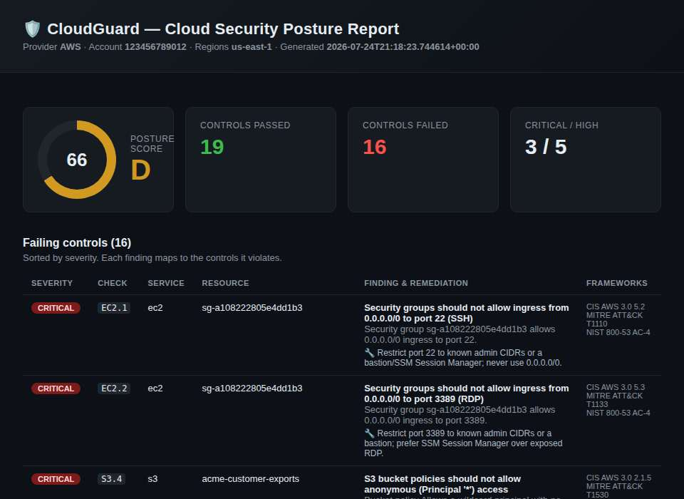
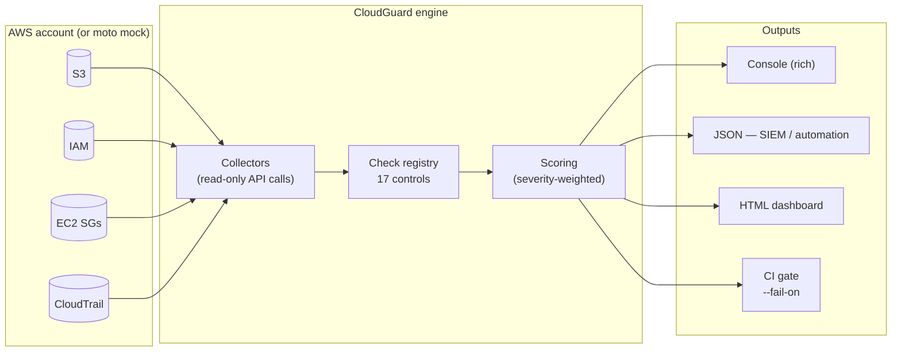

# 🛡️ CloudGuard — Cloud Security Posture Management (CSPM)

> An agentless scanner that audits an AWS account for security misconfigurations,
> maps each finding to industry frameworks (CIS Benchmark, MITRE ATT&CK, NIST
> 800-53), scores the account's posture, and produces SIEM-ready and
> human-readable reports — with a fully offline demo that needs **no AWS account**.

<p align="left">
  
  
  
  
  
</p>



> _The HTML dashboard above is real output from `cloudguard scan --demo`. Open
> [`samples/sample_report.html`](samples/sample_report.html) in a browser for the
> full interactive report, or [`samples/sample_report.json`](samples/sample_report.json)
> for the SIEM-ready JSON._

---

## The problem

Cloud breaches are overwhelmingly caused by **misconfiguration**, not exotic
zero-days: public S3 buckets, security groups open to `0.0.0.0/0`, IAM users
with `AdministratorAccess` and no MFA, and accounts with no audit logging. These
mistakes are easy to make, invisible until exploited, and multiply as an
organization scales across regions and accounts.

**Cloud Security Posture Management (CSPM)** is the discipline of continuously
inventorying cloud configuration and checking it against security best practices.
CloudGuard is a from-scratch CSPM engine that demonstrates how commercial tools
(Prowler, Wiz, AWS Security Hub, Scout Suite) work under the hood.

## What CloudGuard does

1. **Collects** configuration state from AWS APIs (S3, IAM, EC2 security groups,
   CloudTrail) with read-only calls.
2. **Evaluates** each resource against a library of **17 security checks**, each
   annotated with severity and framework control IDs.
3. **Scores** the account with a severity-weighted posture score (0–100 + letter
   grade), so risk is summarized in a single number that trends over time.
4. **Reports** in three formats: a **rich console** summary, a **JSON** document
   for SIEM/automation ingestion, and a self-contained **HTML dashboard**.
5. **Gates CI/CD** — `--fail-on HIGH` exits non-zero, letting you block a pipeline
   that would ship a HIGH-or-worse misconfiguration (shift-left security).

### Why the offline demo matters

CloudGuard ships with a **mock, intentionally-insecure AWS account** built with
[`moto`](https://github.com/getmoto/moto). Anyone can clone the repo and run a
full, realistic scan in seconds — no AWS account, no credentials, no cost — and
see the exact same collectors and checks that run against production:

```bash
pip install -r requirements-dev.txt && pip install -e .
cloudguard scan --demo --html report.html
```

---

## Architecture



**Design principle — separation of concerns:**

| Layer | Responsibility | Extend by… |
|-------|----------------|------------|
| **Collectors** (`cloudguard/collectors/`) | Gather raw state from a service. No judgments. | Adding a new service collector |
| **Checks** (`cloudguard/checks/`) | Turn one resource into PASS/FAIL for one control. | Subclassing `Check` + `@register` |
| **Scoring** (`cloudguard/scoring.py`) | Reduce findings to a weighted score/grade. | Adjusting severity weights |
| **Reporters** (`cloudguard/reporters/`) | Render results for humans and machines. | Adding a new output format |

Adding a check is a ~15-line class with metadata and one `evaluate()` method —
the engine discovers it automatically via a decorator registry. This is the same
plug-in pattern real detection-engineering teams use to scale a rule library.

See [`docs/architecture.md`](docs/architecture.md) for the full design.

---

## Checks catalog

17 checks across 4 services, each mapped to CIS AWS Foundations Benchmark v3.0,
MITRE ATT&CK, and NIST 800-53.

| ID | Severity | Control | Frameworks |
|----|----------|---------|------------|
| **S3.1** | HIGH | Block all public access | CIS 2.1.4 · ATT&CK T1530 · NIST AC-3 |
| **S3.2** | HIGH | Server-side encryption at rest | CIS 2.1.1 · NIST SC-28 |
| **S3.3** | CRITICAL | No public ACL grants | CIS 2.1.5 · ATT&CK T1530 |
| **S3.4** | CRITICAL | No anonymous (`Principal:*`) policy | CIS 2.1.5 · ATT&CK T1530 |
| **S3.5** | MEDIUM | Versioning enabled | CIS 2.1.2 · NIST CP-9 |
| **S3.6** | LOW | Access logging enabled | CIS 2.1.3 · NIST AU-2 |
| **IAM.1** | MEDIUM | Password policy ≥ 14 chars | CIS 1.8 · NIST IA-5 |
| **IAM.2** | HIGH | MFA on console users | CIS 1.10 · ATT&CK T1078 |
| **IAM.3** | HIGH | No direct `AdministratorAccess` | CIS 1.16 · ATT&CK T1098 · NIST AC-6 |
| **IAM.4** | MEDIUM | ≤ 1 active access key per user | CIS 1.13 · NIST AC-2 |
| **EC2.1** | CRITICAL | No `0.0.0.0/0` → port 22 (SSH) | CIS 5.2 · ATT&CK T1110 |
| **EC2.2** | CRITICAL | No `0.0.0.0/0` → port 3389 (RDP) | CIS 5.3 · ATT&CK T1133 |
| **EC2.3** | HIGH | No `0.0.0.0/0` → all ports | CIS 5.4 · ATT&CK T1046 |
| **CT.1** | HIGH | CloudTrail enabled | CIS 3.1 · ATT&CK T1562.008 |
| **CT.2** | MEDIUM | Multi-region trail | CIS 3.1 · NIST AU-2 |
| **CT.3** | MEDIUM | Log file validation | CIS 3.2 · ATT&CK T1070 · NIST AU-9 |
| **CT.4** | LOW | KMS encryption of logs | CIS 3.5 · NIST SC-28 |

---

## Quickstart

### 1. Offline demo (recommended first run — no AWS needed)

```bash
git clone https://github.com/Moh109/cloud-monitor.git
cd cloud-monitor
python -m pip install -r requirements-dev.txt
python -m pip install -e .

cloudguard scan --demo --json out/report.json --html out/report.html
```

### 2. Scan a real AWS account (read-only)

CloudGuard uses your standard AWS credential chain. A **read-only** policy such
as the AWS-managed `SecurityAudit` or `ViewOnlyAccess` is sufficient.

```bash
export AWS_PROFILE=my-profile
cloudguard scan --region us-east-1 --region eu-west-1 --html report.html
```

### 3. Docker

```bash
docker build -t cloudguard .
docker run --rm cloudguard scan --demo                 # offline demo
docker run --rm -e AWS_ACCESS_KEY_ID -e AWS_SECRET_ACCESS_KEY \
  -e AWS_DEFAULT_REGION cloudguard scan --region us-east-1
```

### 4. In CI (shift-left gate)

```bash
# Fails the pipeline if any HIGH-or-worse control is failing.
cloudguard scan --region us-east-1 --fail-on HIGH
```

See [`.github/workflows/ci.yml`](.github/workflows/ci.yml) for a working example
that runs the test suite, produces a posture report, and uploads it as a build
artifact.

---

## Scoring

The posture score is a **severity-weighted pass rate**:

```
score = 100 × (Σ weight of PASSing controls) / (Σ weight of all controls)
weights: CRITICAL=40, HIGH=20, MEDIUM=10, LOW=3, INFORMATIONAL=1
```

Failing a CRITICAL control (e.g. RDP open to the world) moves the needle far more
than failing a LOW one (e.g. missing access logs). Grades: **A** ≥ 90, **B** ≥ 80,
**C** ≥ 70, **D** ≥ 60, **F** < 60. The demo account scores **66 / 100 (D)**.

---

## Project structure

```
cloud-monitor/
├── cloudguard/
│   ├── cli.py              # argparse CLI, --demo / --fail-on / report formats
│   ├── engine.py           # scan orchestration (collect → check)
│   ├── models.py           # Severity, Status, Resource, Finding, ScanResult
│   ├── scoring.py          # severity-weighted posture score + grade
│   ├── demo.py             # provisions the mock insecure account (moto)
│   ├── collectors/         # S3, IAM, EC2 security groups, CloudTrail
│   ├── checks/             # 17 checks + decorator registry
│   └── reporters/          # console (rich), JSON, HTML dashboard
├── tests/                  # unit checks + moto integration (22 tests)
├── samples/                # example JSON + HTML report (committed)
├── docs/                   # architecture + resume/interview guide + screenshot
├── .github/workflows/ci.yml
├── Dockerfile
└── pyproject.toml
```

## Testing

```bash
pytest -q        # 22 tests: per-check unit tests + full moto integration scan
```

---

## Roadmap / ways to extend

- **More services & checks:** RDS encryption, EBS encryption, KMS key rotation,
  public AMIs/snapshots, Lambda public access, GuardDuty enabled.
- **Multi-cloud:** an Azure collector (misconfigured NSGs, storage accounts) behind
  the same check interface.
- **SIEM shipping:** push findings to Elastic/OpenSearch or Splunk HEC and build a
  Kibana dashboard of posture-over-time.
- **IaC scanning:** evaluate Terraform plans pre-deploy with the same rule library
  (true shift-left).
- **Auto-remediation:** optional guarded fixes (enable Block Public Access, revoke
  an open SG rule) with dry-run.
- **Diffing & drift:** compare two scans to alert only on *new* misconfigurations.

See [`docs/resume-and-interview.md`](docs/resume-and-interview.md) for
resume bullet points, the interview questions this project prepares you for, and
the full development roadmap.

---

## ⚠️ Responsible use

CloudGuard performs **read-only** configuration checks. Only scan accounts you own
or are explicitly authorized to assess. The bundled demo environment is entirely
mocked and touches no real infrastructure.

## License

MIT — see [`LICENSE`](LICENSE).
