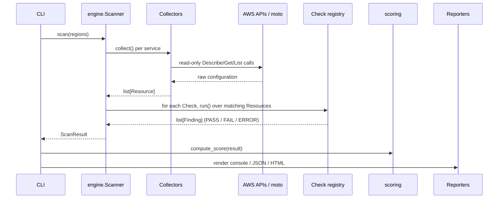

# CloudGuard architecture

CloudGuard is deliberately built around four small, single-responsibility layers.
Understanding this separation is the key to explaining the project in an interview
and to extending it cleanly.

## Data flow



## The four layers

### 1. Collectors (`cloudguard/collectors/`)

Each collector owns one AWS service. It makes **only read-only** API calls and
returns a list of normalized `Resource` objects. A `Resource` carries an id, a
type (e.g. `aws_s3_bucket`), a region, and the raw provider payload in `.raw`.

Collectors make **no security judgments** — they only gather state. When an API
call for an optional feature fails (e.g. `get_bucket_encryption` on an unencrypted
bucket), the collector normalizes the error to `None`; the *absence* of a config
is a signal the checks interpret, not an error to crash on.

A collector declares `scope = "global"` (IAM, S3 — enumerated once) or
`"regional"` (EC2, CloudTrail — enumerated per requested region). The engine uses
this to avoid double-counting global resources in a multi-region scan.

### 2. Checks (`cloudguard/checks/`)

A `Check` is one security control. It declares metadata — `check_id`, `severity`,
`description`, `remediation`, and `frameworks` (the CIS/MITRE/NIST control IDs) —
and implements a single method:

```python
def evaluate(self, resource: Resource) -> bool:  # True == compliant
```

The base class's `run()` wraps `evaluate()`, converts the boolean into a
normalized `Finding`, attaches evidence on failure, and — crucially — catches any
exception and records it as an `ERROR` finding so a single buggy check can never
abort an entire scan.

Checks self-register with a decorator:

```python
@register
class S3EncryptionAtRest(Check):
    check_id = "S3.2"
    resource_type = "aws_s3_bucket"
    ...
```

The engine matches each check to resources by `resource_type`, so adding a control
means writing one class — no wiring, no central list to edit.

### 3. Scoring (`cloudguard/scoring.py`)

Reduces a `ScanResult` to a single **severity-weighted** posture score (0–100)
and letter grade. Weighting means a failing CRITICAL control affects the score far
more than a failing LOW one, matching how real CSPM products prioritize risk.

### 4. Reporters (`cloudguard/reporters/`)

Three renderers over the same `ScanResult`:

- **console** — a `rich` table + score panel for terminal/CI logs.
- **json** — a versioned document (`cloudguard.scan/v1`) for SIEM ingestion and
  automation. Stable schema so downstream tooling can depend on it.
- **html** — a self-contained dark-theme dashboard (Jinja2), ideal for sharing
  and screenshots.

## The demo / test strategy

`cloudguard/demo.py` provisions an intentionally-insecure account using ordinary
boto3 calls. Under `--demo` (and in the integration tests) those calls are
intercepted by `moto`, an in-memory AWS mock. The same collectors and checks run
against the mock as against real AWS, which gives three benefits:

1. **Reproducibility** — anyone can run a full, realistic scan with no cloud account.
2. **Deterministic tests** — the integration suite asserts on known findings.
3. **Honesty** — the demo mixes secure and insecure resources, so reports show a
   realistic PASS/FAIL mix rather than an all-red wall.

## Extending the system

| To add… | Do this |
|---------|---------|
| A new check | Subclass `Check`, set metadata + `evaluate()`, add `@register`. |
| A new service | Add a `Collector` subclass; register it in `collectors/__init__.py`. |
| A new output format | Add a reporter module reading `ScanResult`. |
| A new cloud provider | Implement collectors that emit `Resource`s of new types; write provider-specific checks. The engine, scoring, and reporters are provider-agnostic. |
